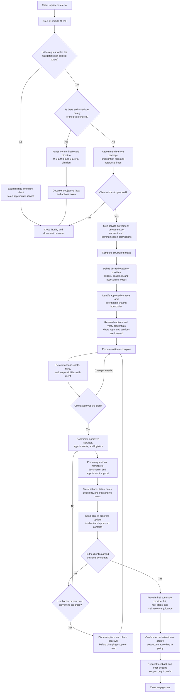

# Kelowna Health & Wellness Navigator — Work Process Flow

## Staff operating checklist

| Stage | Required output | Control point |
|---|---|---|
| Inquiry | Inquiry record and source | Collect minimal personal information |
| Fit screening | Scope decision | Do not provide clinical advice |
| Safety screening | Referral or normal intake decision | Emergencies bypass the sales process |
| Onboarding | Signed agreement and consent | No work or information sharing before authorization |
| Intake | Confirmed goals, constraints, and contacts | Client remains the decision-maker |
| Research | Shortlist with verification dates | Disclose conflicts and avoid pay-to-play referrals |
| Planning | Written action plan | Client approves scope and third-party costs |
| Coordination | Booking and logistics record | Share only the minimum necessary information |
| Follow-up | Progress report and updated action list | Obtain approval for material changes |
| Closeout | Final summary and records decision | Follow privacy and retention policies |

## Client-facing summary

**Connect → Confirm fit → Give consent → Clarify needs → Build a plan → Coordinate services → Follow up → Close or continue**

> The navigator provides non-clinical research, organization, advocacy support, and practical coordination. Medical assessment, diagnosis, and treatment remain with appropriately qualified health professionals.
