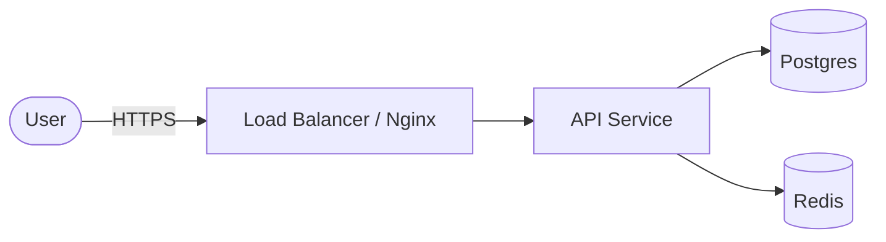

# Architecture

How we design and document systems across the ecosystem. This complements the per-stack standards — it covers the cross-cutting concerns and the decision trail.

## What belongs here
1. **Stack selection** — per [`../../RATCHETING.md`](../../RATCHETING.md), choosing a technology stack is a **mandatory, documented** step. Record the options considered, pros/cons, and the justification (grounded in the target ecosystem) as an ADR.
2. **Architecture Decision Records** — see [`adr/`](./adr). Every significant, hard-to-reverse decision gets one.
3. **System diagrams** — prefer the [C4 model](https://c4model.com) (Context → Container → Component). Keep diagrams as code (Mermaid / PlantUML) alongside the docs so they version and diff.

## Principles
- **Reduced complexity** (NIST SA-8(7)) — the simplest design that meets the requirement wins; justify added moving parts.
- **Criticality analysis** (NIST RA-9) — identify the high-impact components and defend those first; don't over-engineer the rest.
- **Decisions are append-only** — you don't edit history; you **supersede** an ADR with a new one.
- **Documentation is the lock** — if a decision isn't written down here, it doesn't exist for the next session.

## Example: a Container (C4) diagram as code

